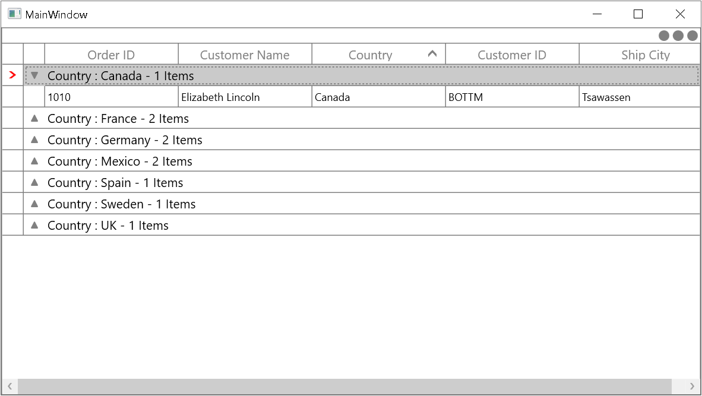

# How to Change the Row Indicator Color in WPF DataGrid?

This sample illustrates how to change the row indicator color in [WPF DataGrid](https://www.syncfusion.com/wpf-controls/datagrid) (SfDataGrid).

You can change the row indicator color by applying style for the `GridRowHeaderCell` in `DataGrid`.

#### XAML
``` xml
<Style TargetType="syncfusion:GridRowHeaderCell">
    <Setter Property="Template">
        <Setter.Value>
            <ControlTemplate TargetType="syncfusion:GridRowHeaderCell">
                <Border x:Name="PART_RowHeaderCellBorder"
                Background="{TemplateBinding Background}"
                BorderBrush="{TemplateBinding BorderBrush}"
                BorderThickness="{TemplateBinding BorderThickness}">
                    <VisualStateManager.VisualStateGroups>
                        <VisualStateGroup x:Name="IndicationStates">
                            <VisualState x:Name="Normal">
                            </VisualState>
                            <VisualState x:Name="CurrentRow">
                                <Storyboard>
                                    <ObjectAnimationUsingKeyFrames Storyboard.TargetName="PART_RowHeaderIndicator" Storyboard.TargetProperty="Data">
                                        <DiscreteObjectKeyFrame KeyTime="0">
                                            <DiscreteObjectKeyFrame.Value>
                                                <Geometry>F1 M 390.741,274.667L 387.928,274.667L 393.048,280L 387.927,285.333L 390.741,285.333L 396.073,280L 390.741,274.667 Z</Geometry>
                                            </DiscreteObjectKeyFrame.Value>
                                        </DiscreteObjectKeyFrame>
                                    </ObjectAnimationUsingKeyFrames>
                                </Storyboard>
                            </VisualState>
                        </VisualStateGroup>
                    </VisualStateManager.VisualStateGroups>
                    <Path x:Name="PART_RowHeaderIndicator"
                    Width="8.146"
                    Height="8.146"
                    HorizontalAlignment="Center"
                    VerticalAlignment="Center"
                    Fill="Red"
                    Stretch="Fill">
                    </Path>
                </Border>
            </ControlTemplate>
        </Setter.Value>
    </Setter>
</Style>
```



## Requirements to run the demo
 Visual Studio 2015 and above versions
